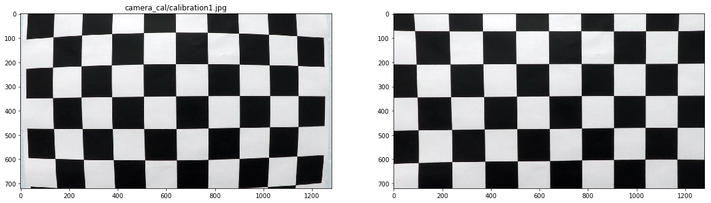
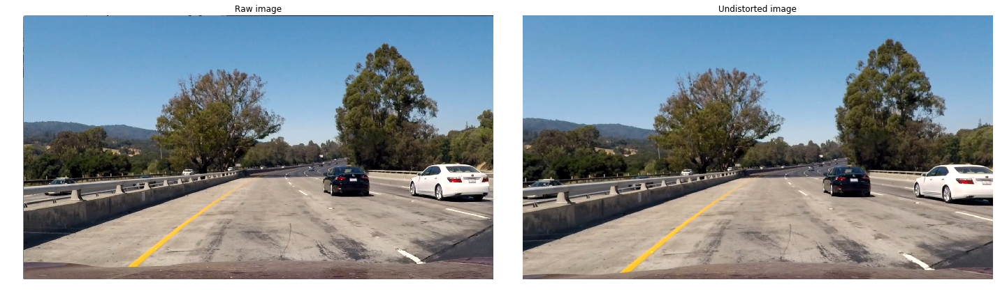
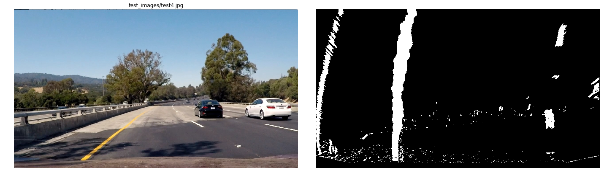
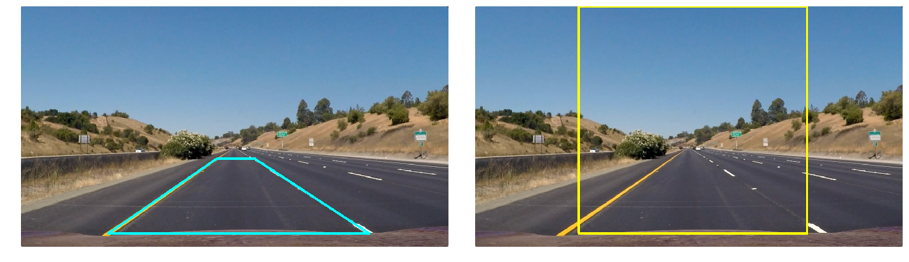
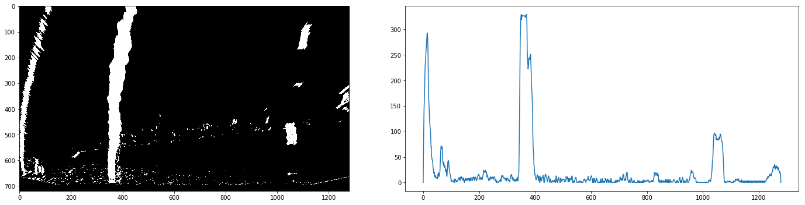
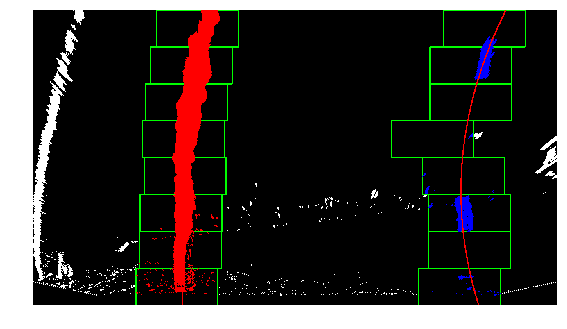
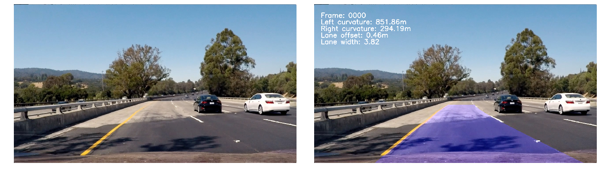

## Advanced Lane Line Detection Project

The goals / steps of this project are the following:

* Compute the camera calibration matrix and distortion coefficients given a set of chessboard images.
* Apply a distortion correction to raw images.
* Use color transforms, gradients, etc., to create a thresholded binary image.
* Apply a perspective transform to rectify binary image ("birds-eye view").
* Detect lane pixels and fit to find the lane boundary.
* Determine the curvature of the lane and vehicle position with respect to center.
* Warp the detected lane boundaries back onto the original image.
* Output visual display of the lane boundaries and numerical estimation of lane curvature and vehicle position.

## [Rubric](https://review.udacity.com/#!/rubrics/571/view) Points

### Here I will consider the rubric points individually and describe how I addressed each point in my implementation.  

---

### Writeup / README

#### 1. Provide a Writeup / README that includes all the rubric points and how you addressed each one.  You can submit your writeup as markdown or pdf.

This is the writeup.

### Camera Calibration

#### 1. Briefly state how you computed the camera matrix and distortion coefficients. Provide an example of a distortion corrected calibration image.

Camera calibration is contained in its own Jupyter Notebook called "Step 1 - Camera Calibration.ipynb".

For camera calibration, I directly adapted the `camera_calibration.ipynb` notebook in the Udacity `CarND-Camera-Calibration` repo. I modified it for the 6x9 chessboard images in Project 4.  This uses the apparent distortion in chessboard pattern images captured from different vantage points to reverse engineer the camera optics that was used to capture the images.  This is done with the OpenCV `findChessboardCorners` function to detect chessboard corners, and `calibrateCamera` for camera calibration.

In the notebook, I scan all the calibration images for chessboard corners.  I draw and display the chessboard corners for every calibration image where a chessboard was detected using OpenCV `drawChessboardCorners`.  Note that chessboard corners are not detected for every image - if the chessboard is larger than full image, then corners are not detected.  Below is an example of a chessboard where the corners are not detected.

Next, I compute the calibration parameters with `cv2.calibrateCamera`.  I save the distortion coefficients and camera matrix computed by OpenCV into a dictionary that I pickle for later use in the lane finding routines.

Finally, I use the distortion coefficients and camera matrix to remove the camera distortion for all the calibration images and show them in the notebook.  This is done with the `cv2.undistort` routine.

Here is an example from the calibration images (the same one as above).

### Pipeline (single images)

The rest of the project is done in the `Step 2 - Advanced Lane Line Images` Jupyter notebook, for both images and video.

#### 1. Provide an example of a distortion-corrected image.

In the `Step 2` notebook, the camera distortion coefficients and camera matrix are loaded from the `calibration.pkl` pickle file in cell `[3]`.

Then `cv2.undistort` is used to remove distortion from all the images.

Below is an example from the provided test images.  The effect is somewhat subtle, but the hills to the left and the white car are clearly transformed.

#### 2. Describe how (and identify where in your code) you used color transforms, gradients or other methods to create a thresholded binary image.  Provide an example of a binary image result.

I used a combination of following for creating a thresholded binary image.  This defined in cell `[13]`

1. HLS color space transformation
2. Sobel gradients with derviative in X axis to emphasize vertical lines

With HLS I used the L (light) and S (saturation) channels.

Below is an example of the binary thresholded image.

#### 3. Describe how (and identify where in your code) you performed a perspective transform and provide an example of a transformed image.

For perspective transformation, I experimented with different approaches for generating the transformation parameters including computing the shape.  In the end, I manually tuned to fit the road lanes in a particular test image to become parallel in the bird's eye view.

This is defined in cell `[7]`.

This resulted in the following source and destination points:

| Source        | Destination   | 
|:-------------:|:-------------:| 
| 260, 680      | 310, 680        | 
| 585, 456      | 310, 0      |
| 700, 456     | 993, 0      |
| 1043, 680      | 993, 680        |

I verified that my perspective transform was working as expected by drawing the source and destination points onto a test image and its warped counterpart to verify that the lines appear parallel in the warped image.

#### 4. Describe how (and identify where in your code) you identified lane-line pixels and fit their positions with a polynomial?

The main lane detection logic of my code is defined in cells `[16]` through `[19]`. Cell `[25]` contains the overall image processing pipeline from image distortion removal through displaying output.  Cell `[23]` contains the output display routine.

Cell `[16]` contains global state variables used during pipeline processing, as well as global hyperparameters used to tune the lane detection pipeline.

Cell `[18]` defines the Lane object used to keep state during video pipeline processing.

Cell `[19]` contains the full lane detection logic.  This includes functions to initalize the global state, and a large Python function with several local utility functions.

Lane line detection uses the approach from the lectures, with both full image sliding window search when no lanes have been detected, as well as local-region search when lanes have been detected. If local-region search fails to detect a good set of lanes, then full sliding window search is done in the next iteration.

The full sliding window search works on histograms of pixel density along the X-axis to see what points along the horizontal dimension have the highest number of thresholded pixels.  I took the histogram on the lower 50% of the thresholded binary image as done in the lectures.

As an example, for the same test image as the binary thresholding above, the histogram appears as below.

Full window search does the following to find lane lines.

1. For each half (left and right 50%) of the image, find the highest points in the histogram and use them as the initial point of the search.  i.e. the X-coordinate in the left half with the higest number of pixels along the X-axis is taken as the center of the lane line search in the left side.  Equivalent is done for right lane.
2. Divide the y-axis into a fixed number of segments - this is the number of windows to search for each lane.
3. Define a margin to search to left and right of the center point.
4. For each window, find the number of nonzero pixels in the window.  If the number of found pixels is greater than a threshold, move the center to the average X position of the found pixels, and repeat.

When all the windows have been searched, we now have a collection of pixels for both left and right side.  From the `x` and `y` coordinates of those pixels, we fit a 2nd order polynomial 
using the `numpy` `polyfit` routine.

The image below shows the result of full sliding window search on the test image from above.

#### 5. Describe how (and identify where in your code) you calculated the radius of curvature of the lane and the position of the vehicle with respect to center.

Cell `[17]` contains the curvature computation.  This uses the appproach from the lectures.

In addition to curvature and lane deviation from center, this routine returns the detected lane width.  The lane width is used as one of the factors to determine if the lane detection failed or succeeded.

#### 6. Provide an example image of your result plotted back down onto the road such that the lane area is identified clearly.

Image annotation with detected lane positions and curvature is done in the `annotate_image` function defined in cell `[23]`.

Using the same example from the last few images, the detected lane is shown below.

---

### Pipeline (video)

#### 1. Provide a link to your final video output.  Your pipeline should perform reasonably well on the entire project video (wobbly lines are ok but no catastrophic failures that would cause the car to drive off the road!).

Here are links to the output of my pipline for the videos.

* [Project video](./output_images/project_video_output.mp4)
* [Challenge video](./output_images/project_video_challenge_output.mp4)
* [Harder challenge video](./output_images/project_video_harder_challenge_output.mp4)

My video pipeline implements the following.

1. Both full sliding window search and local-region search.  The local-region search uses the last detected lane lines as the starting point for detecting lane pixels.  Local region search avoids computing the histogram of the image, and detecting the maximum points based on the histogram.
2. After detecting lane pixels, the algorithm determines the quality of the detected pixels based on several factors.
    * Lane width: The pipeline maintains a running average of detected lane widths.  If the lane width is greater or smaller than the average by a defined fraction (a hyperparameter), then the detected lane is rejected.  This helps (but not completely) with the challenge video toward the end when it is often the case that the road barrier is detected as a lane line.
    * Lane deviation: If the car appears to be too far off to one side of the center, then the detected lane is rejected.
    * If the fit polynomial (after smoothing - see below) results in the lanes crossing, the detected lane is rejected.  As submitted, this is detected if the right line at the top is to the left of the left line.
3. For frames where the lane detection is rejected, and to smooth out the lane lines from frame to frame, a moving average of the last few detected lane lines is used.
    * As I did in the basic lane line detection project, I use a deque to store a configurable number of the most recently detected lane lines.  The deque stores the fit polynomial coefficients.  A weighted average of the coefficients is used as the smoothed fit.
    * The smoothing weights depends on the size of the smoothing window.  I take a linear interpolataion between 0.1 and 1.0, with number of points equal to the smoothing window.  Then those are squared so that the final weights are between 0.01 and 1.0, growing quadratically.

---

### Discussion

#### 1. Briefly discuss any problems / issues you faced in your implementation of this project.  Where will your pipeline likely fail?  What could you do to make it more robust?

My pipeline work very well on the basic project video.

The pipeline performance improved over time for the challenge and harder challenge videos, but there is still a lot of room for improvement on both.

One challenge I had was in tuning the binary thresholds.  With the challenge video, it was still difficult to completely separate out the left road barrier from the left lane line at times.  Since the road barrier has high gradient, I tried relying more on color over gradient but that resulted in poor line detection overall.

In both the challenge and harder challenge video, the weighted average smoothing sometimes 'remembers' the recent past too much, resulting in 'imaginary' lane lines.

With sliding window search, the search is heavily dependent on the density of pixels in the lower half of the image.  If the highest density based on thresholding is incorrect, the search starts with bad initial conditions and it is difficult to recover from that.

For both sliding window and local region search, the left/right margin determines how far pixels are searched for the lane lines.  If the lane curves very rapidly as it does in the harder challenge video, this can incorrectly limit how far the algorithm will look for the lane lines.
